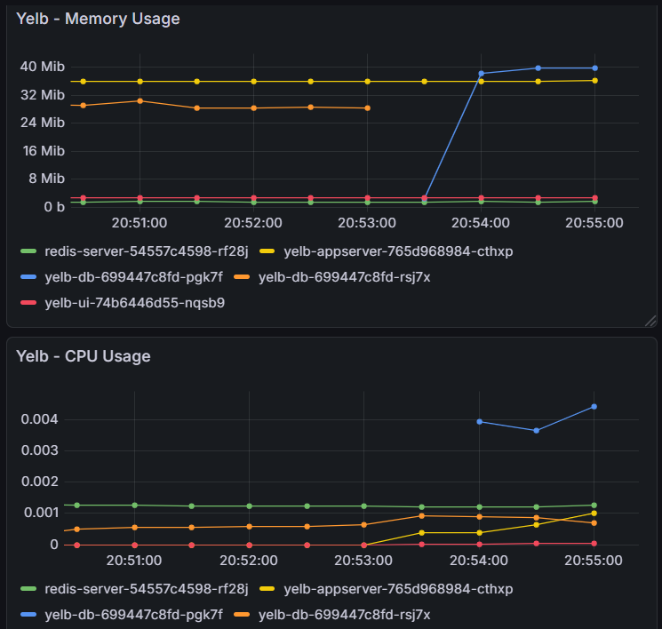

# 📦 SRE in a Box: A Local Reliability Engineering Lab

## 🎯 Overview
This repository contains a fully functional, local Site Reliability Engineering (SRE) laboratory. The goal of this project is not just to build software, but to demonstrate end-to-end SRE practices: Infrastructure as Code (IaC), microservices deployment, observability, traffic routing, chaos engineering, and blameless incident response.

Instead of relying on expensive managed cloud services (e.g., AWS EKS), this environment is engineered to run entirely on a local machine with strict resource constraints (Intel i7, 16GB RAM). It showcases advanced architectural trade-offs, resource tuning, and the ability to simulate a production-like distributed system locally.

## 🏗️ Architecture & Technologies

* **Infrastructure (IaC):** Terraform automating `k3d` (Lightweight Kubernetes).
* **Container Engine:** Native Docker Engine running on Windows Subsystem for Linux (WSL2) to minimize memory overhead.
* **Microservices Application:** [Yelb](https://github.com/mreferre/yelb) (UI, AppServer, Redis, PostgreSQL).
* **Networking:** Traefik Ingress Controller for traffic routing.
* **Observability:** Prometheus, Grafana, and Alertmanager (`kube-prometheus-stack`), alongside custom PromQL Dashboards exported as JSON.
* **Chaos Engineering:** Chaos Mesh.
* **Documentation:** Blameless Post-Mortems in Markdown.

## 🤔 Technical Decisions & Trade-offs

To ensure the entire stack runs smoothly on 16GB of RAM without crashing, the following SRE decisions were implemented:
1. **WSL2 + Native Docker Engine:** Bypassed Docker Desktop entirely. Running the Docker daemon natively inside Ubuntu (WSL2) drastically reduced idle RAM consumption.
2. **k3d over Minikube/Cloud:** `k3d` runs a highly available K3s cluster inside Docker containers, consuming only ~700MB of RAM for the entire control plane and worker nodes.
3. **Aggressive Resource Limits:** The observability stack (Prometheus/Grafana) was aggressively tuned via a custom Helm `values.yaml`. Retention was dropped to 1 day, and memory limits were strictly capped (e.g., Prometheus limited to 512Mi) to prevent out-of-memory (OOM) kills.

## 🚨 Incident Response & Chaos Scenarios

This lab is about breaking things intentionally to validate resilience. Below is the log of simulated incidents and their corresponding blameless post-mortems:

| Date | Incident Scenario | Tool Used | Post-Mortem Report | Status |
| :--- | :--- | :--- | :--- | :--- |
| 2026-02-20 | Database Pod Deletion (Hardware Failure Sim) | Chaos Mesh | [Read Report](./docs/post-mortems/01-database-outage.md) | 🟢 Resolved |
| YYYY-MM-DD | Network Latency Injection on Checkout | Chaos Mesh | [Read Report](./docs/post-mortems/02-network-latency.md) | 🚧 Planned |
| YYYY-MM-DD | CPU Stress on Worker Node | Chaos Mesh | [Read Report](./docs/post-mortems/03-cpu-stress.md) | 🚧 Planned |

### Chaos Engineering in Action
*During the database failure simulation, the control plane successfully identified the missing pod and spun up a replacement, recovering the application without human intervention.*



## 🚀 How to Run This Lab Locally

### Prerequisites
* Windows Subsystem for Linux (WSL2 - Ubuntu)
* Native Docker Engine (Running inside WSL, no Docker Desktop)
* `terraform`, `kubectl`, `helm`, and `k3d` CLI tools.

### Step-by-Step Execution

**1. Provision Infrastructure:**
```bash
cd infrastructure
terraform init
terraform apply -auto-approve
```

**2. Deploy the Microservices & Ingress:**
```bash
kubectl apply -f app/yelb-deployment.yaml
kubectl apply -f app/yelb-ingress.yaml
```
### Access the app at http://localhost:8080

**3. Deploy Observability Stack:**
```bash
helm repo add prometheus-community https://prometheus-community.github.io/helm-charts
helm install monitoring prometheus-community/kube-prometheus-stack -f observability/prometheus-values.yaml -n monitoring --create-namespace
```
### Forward port 3000 to access Grafana and import the custom dashboard from observability/yelb-dashboard.json

**4. Inject Chaos (Kill the Database):**
```bash
helm repo add chaos-mesh https://charts.chaos-mesh.org
helm install chaos-mesh chaos-mesh/chaos-mesh -n chaos-mesh --create-namespace --set dashboard.securityMode=false
kubectl apply -f chaos-engineering/kill-db.yaml
```
### Built to demonstrate continuous improvement, resilience, and site reliability engineering principles.